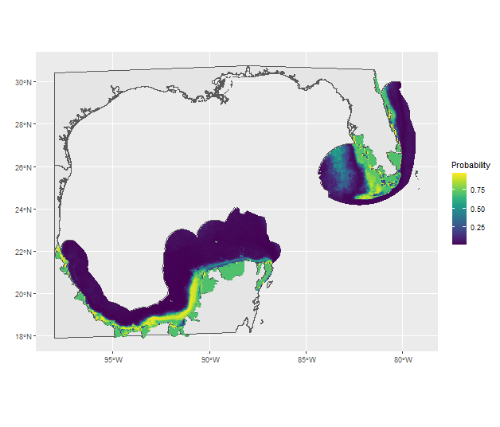

## FlexSDM

Welcome to the [FlexSDM](https://github.com/sjevelazco/flexsdm) showcase for the course "MET-1 Spatial Modeling and Prediction"
of the [EAGLE M.Sc.](http://eagle-science.org/) program. Is this showcase we model the species distribution of 
"Lupinoblennius nicholsi" (Highfin blenny) around the Gulf of Mexico. All data is available directly in the Repository.
\
The mapping is done via occurrence data from [RedList](https://www.iucnredlist.org/) and pseudo-absences calculated by
the FlexSDM package, as well as the following environmental variables extracted from the MODIS-Aqua Ocean Color SMI:
- Chlorophyll concentration
- Normalized fluorescence line height
- Particulate organic carbon
- Sea Surface temperature

The prediction variables were acquired using this
[the following GEE script](https://code.earthengine.google.com/558c7b412b0ddebc363a5414369aca9d):
\
```javascript
var useable = modisaqua
  .filterBounds(geometry)
  .filterDate("2018-01-01", "2018-12-31")
  .map(function(image){
    return image.clip(geometry)
  })
  .mean()
  
Export.image.toDrive({
  image: useable.select("sst", "chlor_a", "nflh", "poc"),
  description: 'varfile_golf',
  crs: 'EPSG:4326',
  region: geometry
});
  
  
Map.addLayer(useable, {bands: ["sst"], min: -2, max: 40, palette: ["blue", "red"]}, "SST")
```

The end result will sort of look like shown in the following figure:
\



Have fun in the course!
\
\
Sarah and Konstantin

